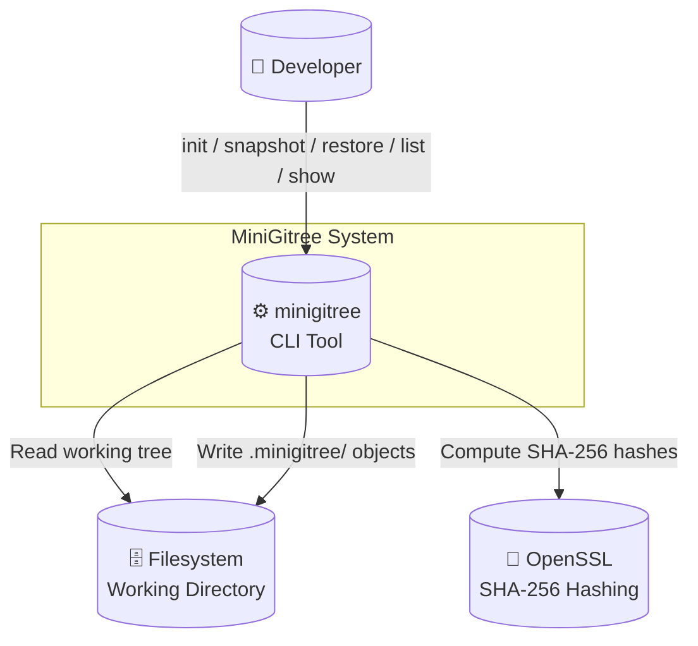
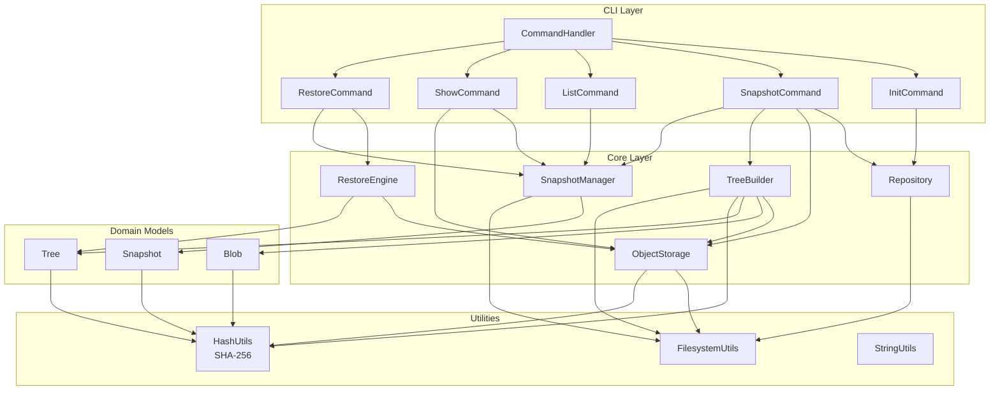
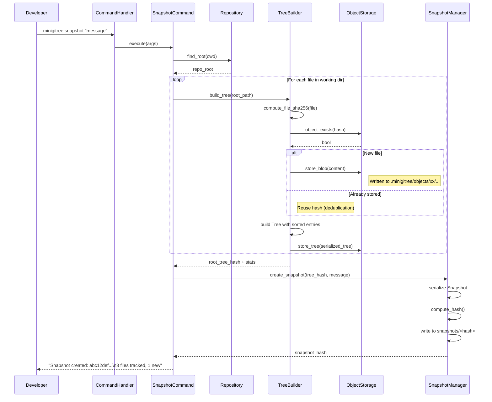
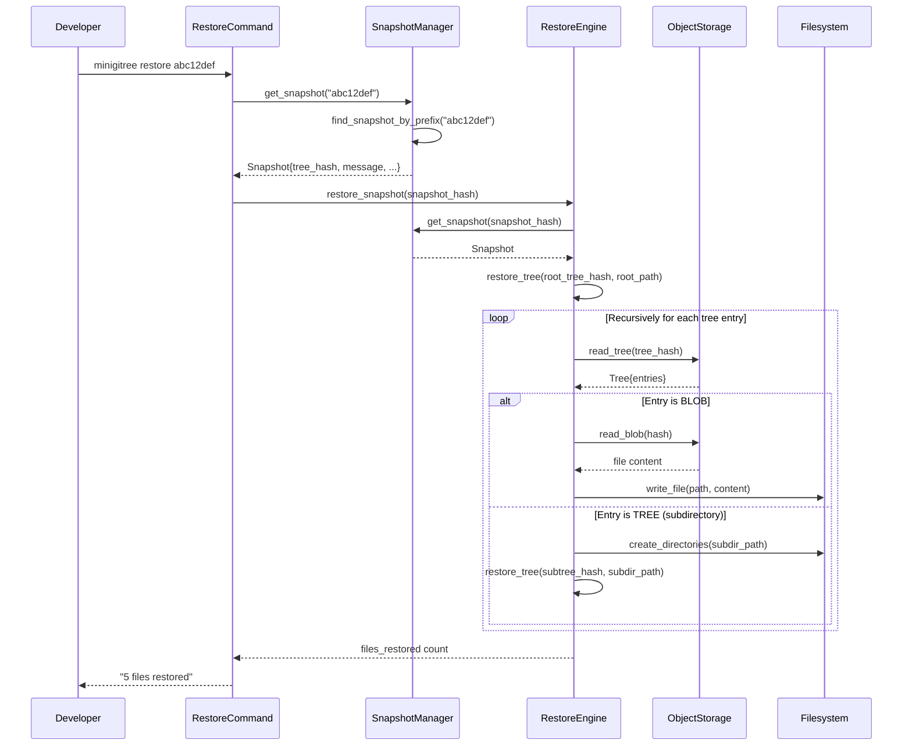
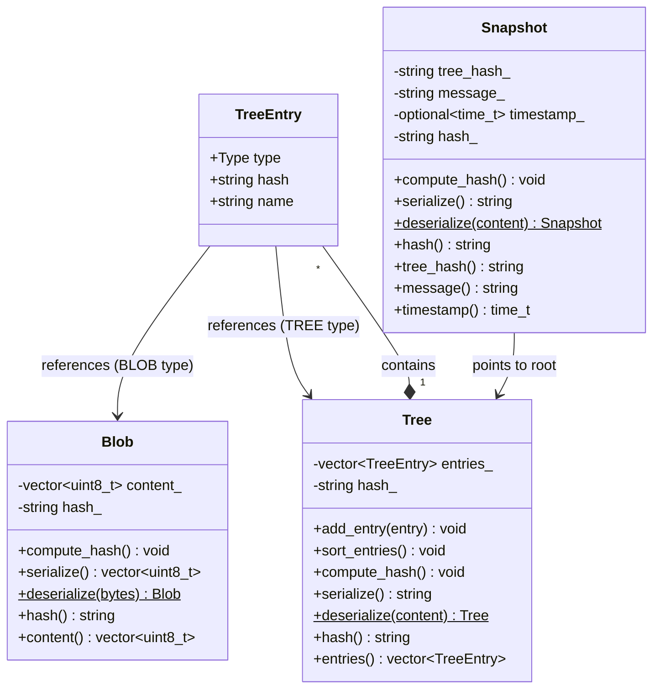
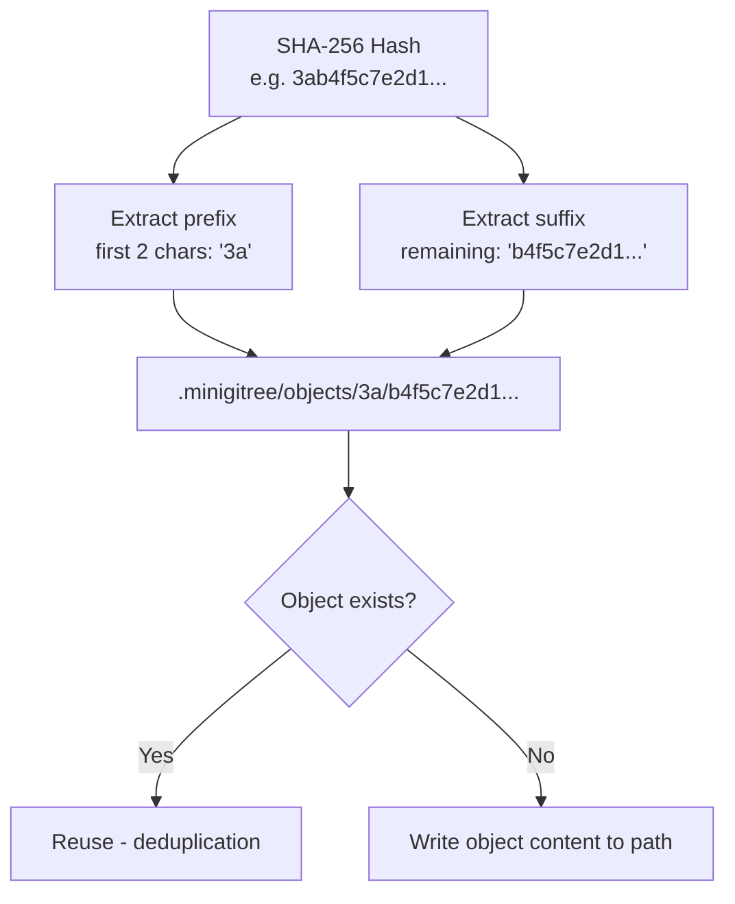
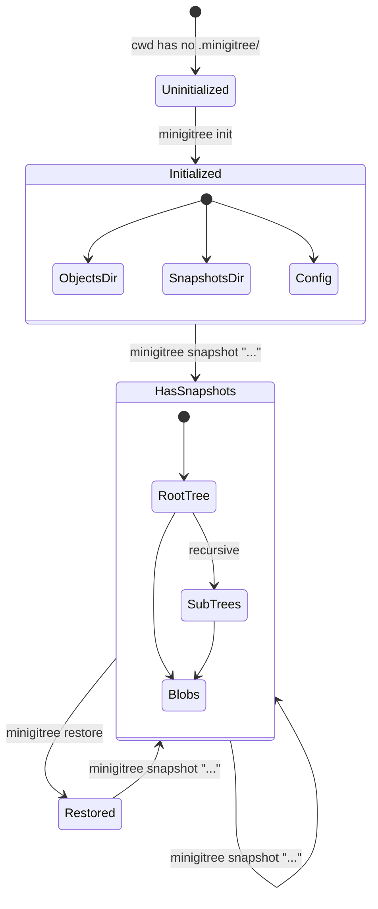
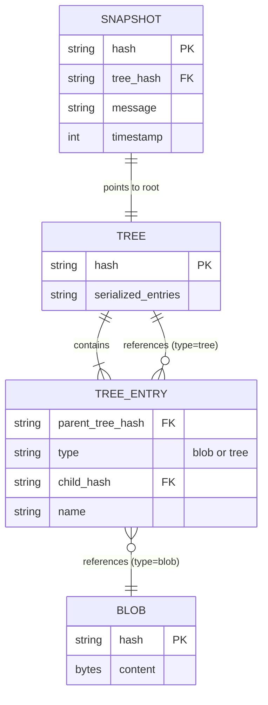

# MiniGitree Architecture Diagrams

## 1. C4 Context — System Overview

---

## 2. C4 Component — Internal Structure

---

## 3. Sequence — Snapshot Creation

---

## 4. Sequence — Restore Snapshot

---

## 5. Class Diagram — Domain Models

---

## 6. Flowchart — Object Storage Path Resolution

---

## 7. State Diagram — Repository Lifecycle

---

## 8. ER Diagram — On-Disk Data Model

